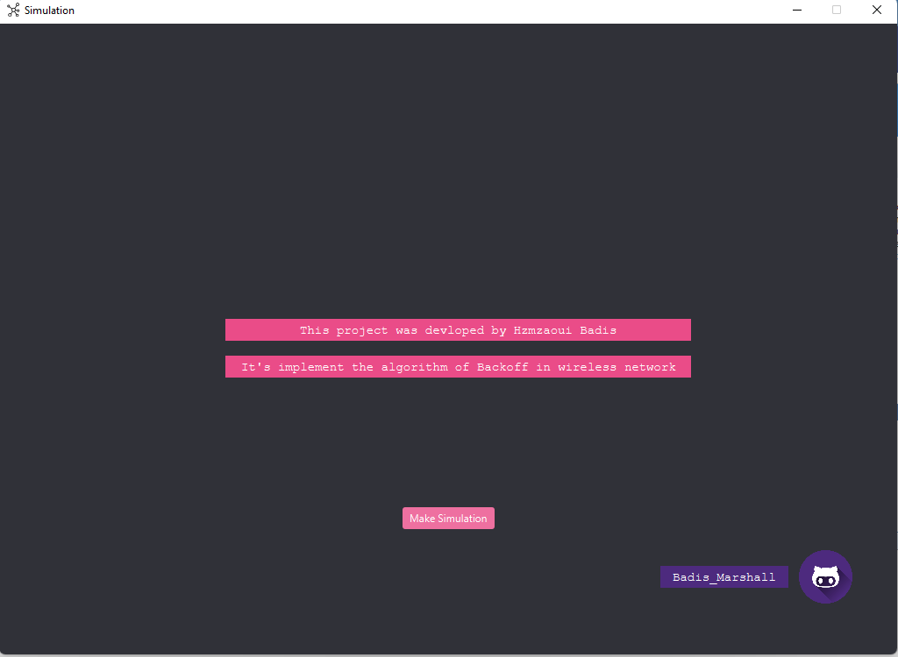
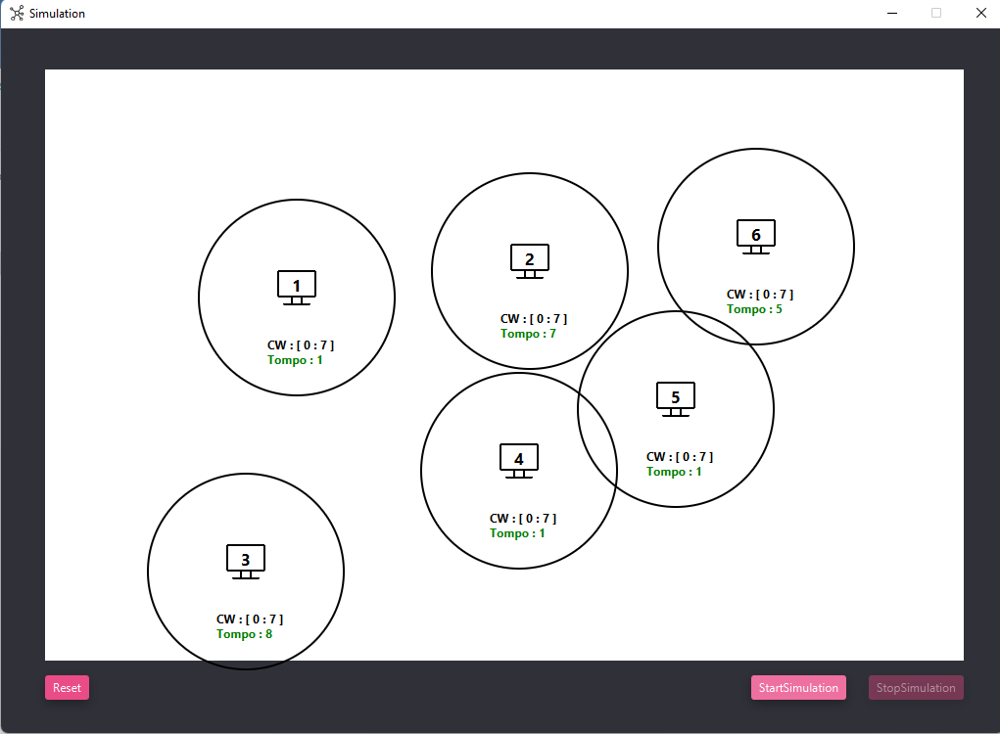

# CSMA_CA-Backoff_Based

Dans un réseau locaI (LAN), tous les participants au réseau partagent un medium de transmission : un câble, le dit « bus ». Les réseaux sans fil ne connaissent naturellement pas de câble, mais même dans le Wifi, tous les appareils concernés envoient et reçoivent via un seul support ou médium de transmission, à savoir une certaine portée radio. A cet égard, le Wifi (IEEE802.11) est comparable aux premiers réseaux Ethernet demi Duplex. Par conséquent, il doit y a avoir un protocole pour un réseau sans fil qui réglemente l’utilisation du support.

# Ui

